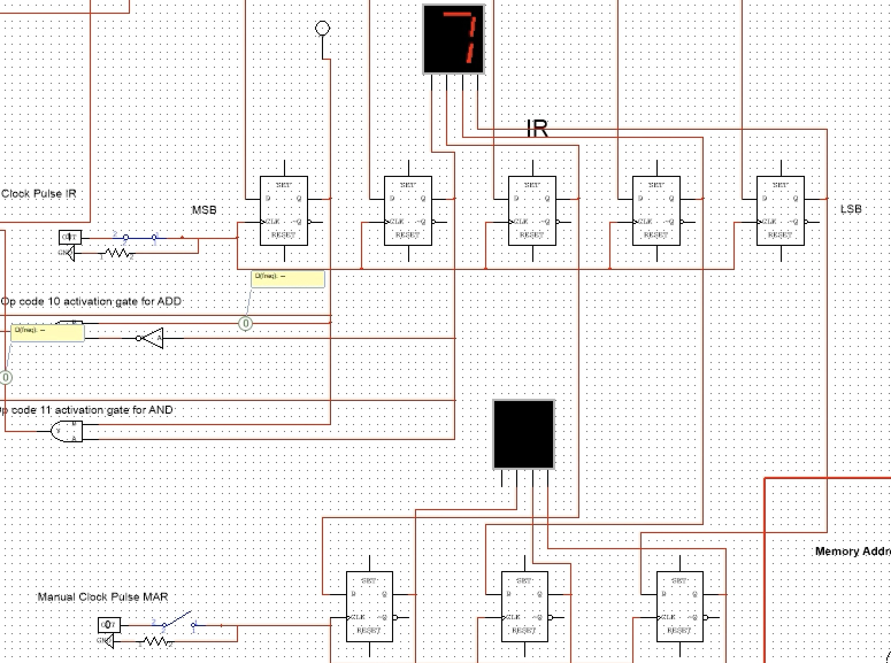
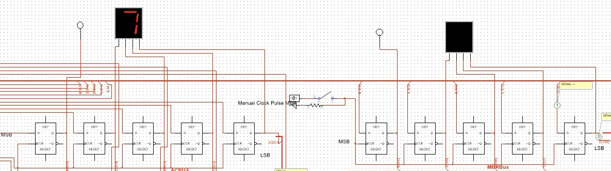
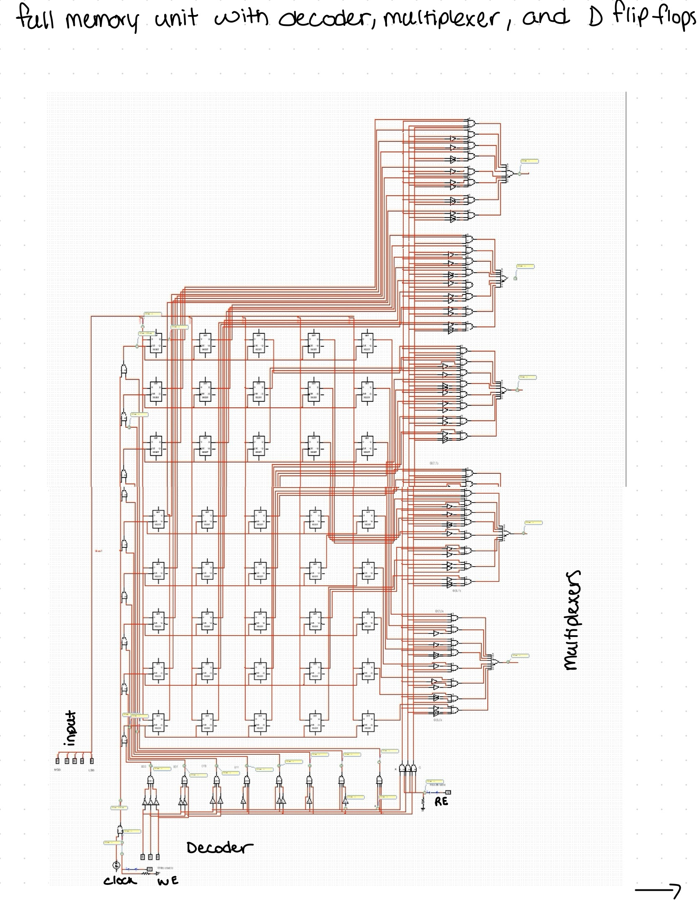
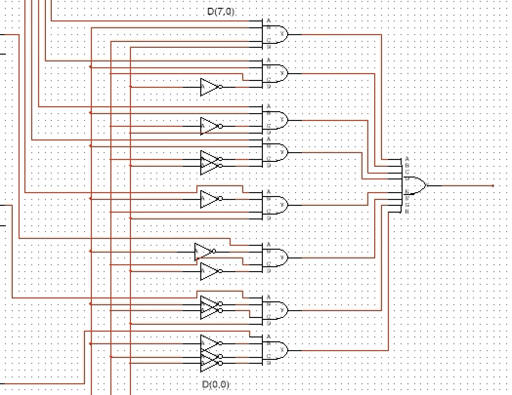
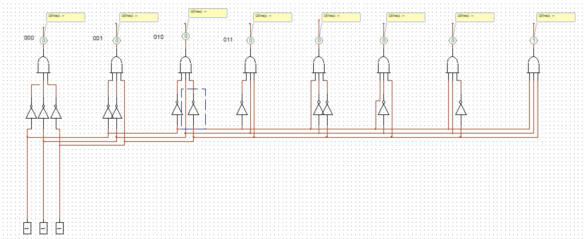
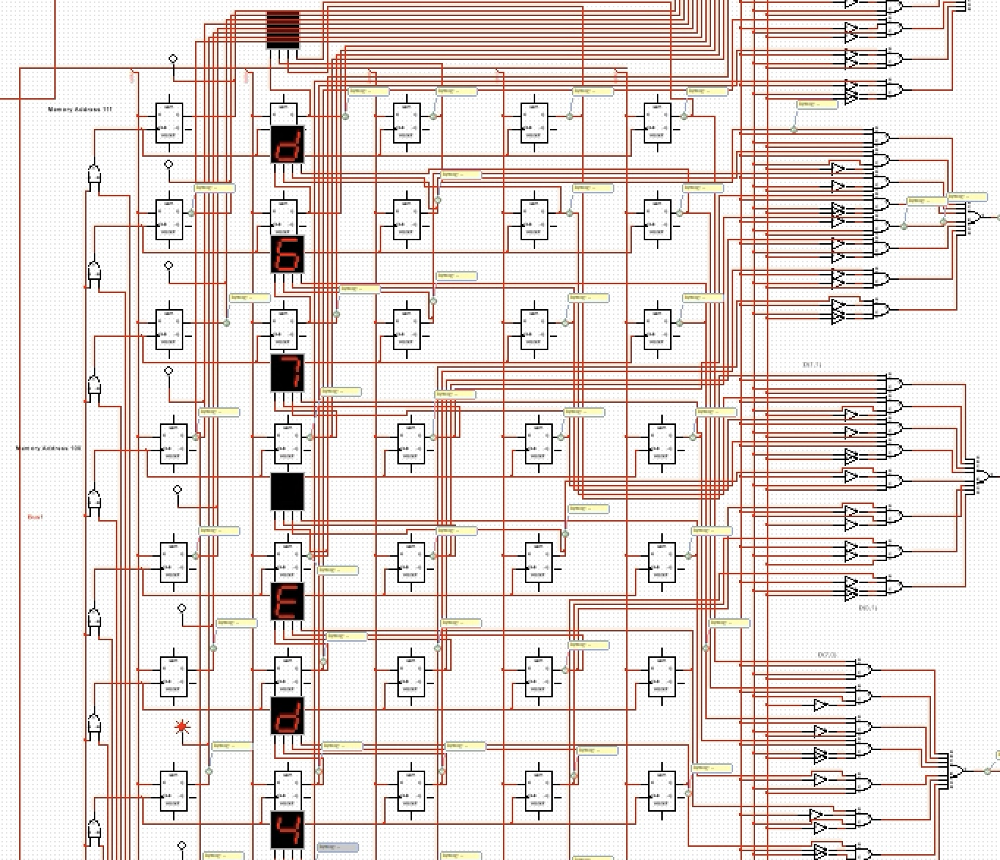
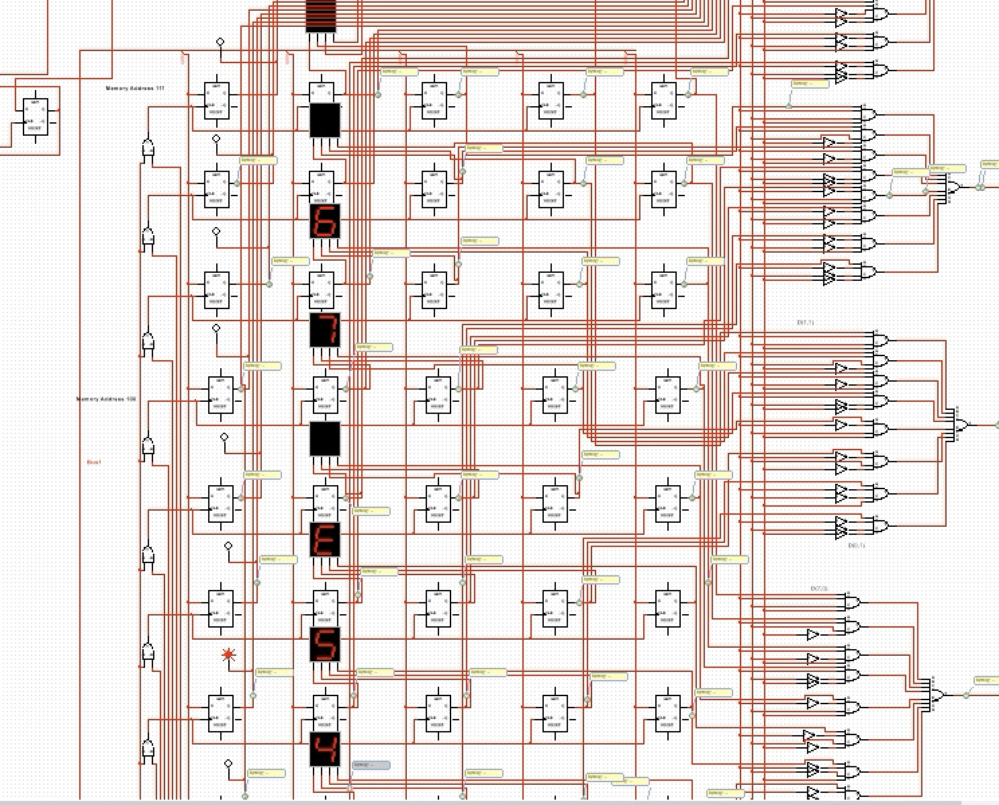

# 5-bit CPU Simulation (NI Multisim)

This project showcases a custom 5-bit CPU architecture designed and simulated entirely in NI Multisim. The design replicates key components found in real-world CPUs, including a memory system, control logic, and execution cycle. The instruction set is based loosely on the MARIE architecture and supports simple fetch-decode-execute logic.

## Architecture Overview

The design includes the following major components:

- Instruction Register (IR)
- Memory Address Register (MAR)
- Accumulator (AC)
- Memory Buffer Register (MBR)
- Multiplexer and Decoder Logic
- ALU and Output Bus
- CPU operations: AND, ADD

All subsystems were wired and configured manually, with logical control lines and memory locations verified using program data.

## Image Gallery

### IR and MAR Diagram  
`images/IR-and-MAR-diagram.jpg`  

### Accumulator and MBR Registers  
`images/Accumulator-and-MBR-registers.jpg`  

### Full Memory Design  
`images/Full-Memory-Design.jpg`  

### Multiplexer Logic  
`images/Multiplexer-Design.jpg`  

### Decoder Logic  
`images/Decoder-Diagram.jpg`  

### Program 1 Stored in Memory  
`images/Program-1-Stored.jpg`  

### Program 2 Stored in Memory  
`images/Program-2-Stored.jpg`  

## How to Run

1. Open the `.ms14` schematic in NI Multisim.
2. Step through the instruction execution cycle using clock triggers or simulation steps.
3. Programs can be entered into memory manually by editing values at known addresses (e.g., 100–107).
4. Monitor output via 7-segment displays and connected logic gates.
5. Use the correct MARIE op-code to execute AND or ADD instructions

## Notes

This project was designed entirely from scratch, including all wiring, control logic, and memory structures. It was created as part of a Computer Architecture lab to demonstrate understanding of digital systems and CPU internals.

##LinkedIn

**Marshall Tucker**  
Computer Science Student, Kennesaw State University  
[LinkedIn: linkedin.com/in/marshall-tucker](https://www.linkedin.com/in/marshall-tucker-3666782ab/)
